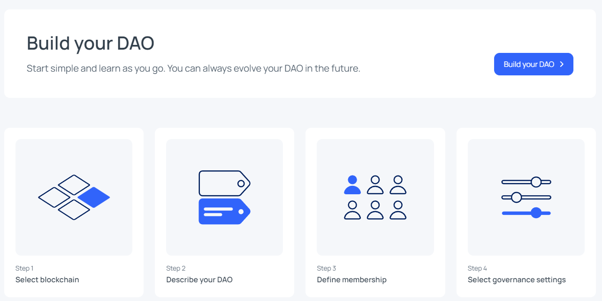

# Criar DAO

Um roteiro mínimo para a criação de uma DAO.

## 1 - Nomear a DAO

Criar um nome sugestivo que já demonstre o objetivo da DAO.

## 2 - Missão da DAO

Assim como uma empresa possui a missão e a visão, a DAO deve ter ao menos uma declaração do que trata, afim de comunicar aos futuros membros o objetivo da organização.

## 3 - Entrega da DAO

É a descrição de valor que esta DAO irá gerar, seja ele no meio físico, moeda fiduciária, tokens, serviços etc.

## 4 - Mídias Sociais e canais de comunicação

É de grande importancia estar presente em ambientes como Discord, Twitter, entre outros para que os membros da DAO, possam interagir entre si.

## 5 - Convidar pessoas

Deve-se procurar por pessoas interessadas a participar na DAO e traze-las para a organização.

## 6 - Criar Tokens de Governança

A criação de tokens de governança, basicamente é a criação e distribuição de um token que dê direito a voto.

## 7 - Captação de Recursos

A captação pode ser feita através dos próprios membros, na aquisição de tokens de governaça, ou também com o fornecimento de algum outro token, ou serviço realizado pela DAO.

## 8 - Ferramentas para contribuições dos membros

Existem diversas ferramentas disponíveis no mercado. Por exemplo a [Aragon](https://app.aragon.org/) que é uma ferramenta que faz toda a criação base de uma DAO.

A ferramenta que permite a criação de uma DAO, bem como a implementação de alguma políticas.

Por exemplo: Criar 1.000.000 tokens de governança que serão vendidos e ou distribuídos para os membros.

Desta forma pode-se criar regras como: Apenas os membros com + 1.000 tokens de governança tem direito a voto, ou definir um peso de acordo com a quantidade de tokens.

Pela ferramenta é possível ver a quantidade de membros, a distribuição dos tokens, de forma bastante amigável.

A implementação de políticas como: Definir um mínimo de tokens, para que um membro possa fazer uma proposição, facilita a organização do trabalho da DAO.

